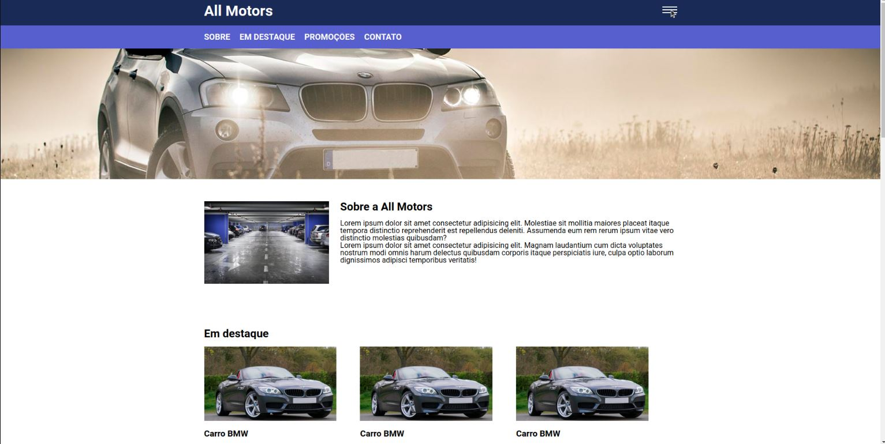

# aplicação web para um loja de carros nome da aplicação All New Motors
### Licença vinculada ao repositório: 

#
### Tecnologias utilizadas: 

 
    
    
    
     
    

#

### Explicando o projeto:

1. No cabeçalho da aplicação podemos ver um menu do tipo sandwich, ao clicar nele aparece  algumas anternativas de menu. veja nas imagens a seguir: 
    
    - Clicando no menu:
    
2. Ao clicar em um carro que goste a pagina vai te direcionar ao formulario e vai preencher-lo automaticamente o campo de entrada do nome do carro, com o nome do carro em que você clicou.
    
    

3. Ao preencher o formulário, será mostrado um prompt(alert) com uma mensagem de erro, e embaixo de cada campo do formulário será exibida uma mensagem personalizada sobre o erro de preenchimeneto, utilizado nesse formulário máscaras do Jquery. Caso todos os campos estiverem sido preenchidos de acordo, será exibida uma mensagem de envio.
    
   
 <h2>Visualização Online</h2>
  
A landing page do projeto está disponível para visualização na Vercel. Você pode acessá-la através do seguinte link:
 https://all-new-motors-3h6z.vercel.app/?vercelToolbarCode=zFBb_SHNIlDcU_A
